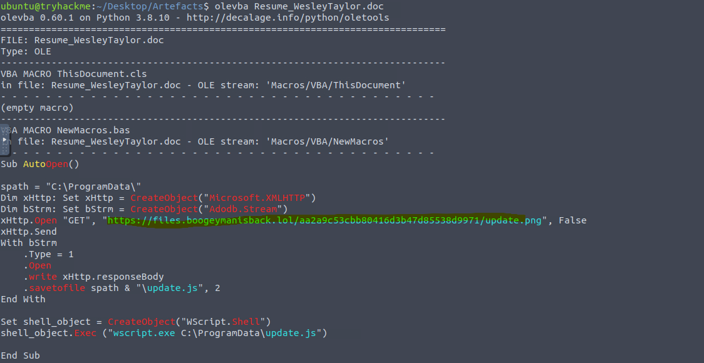
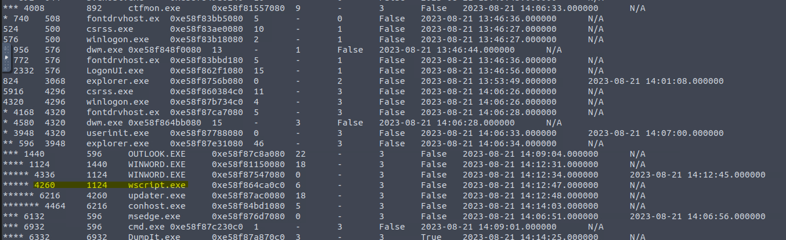
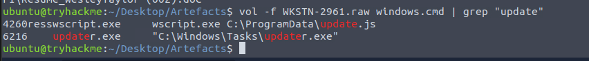
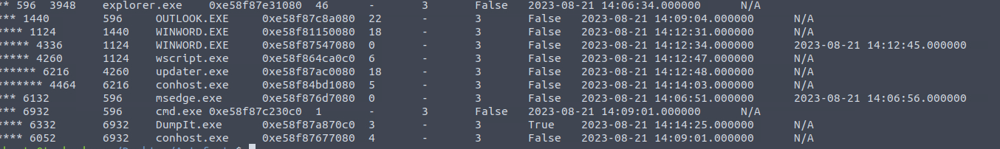
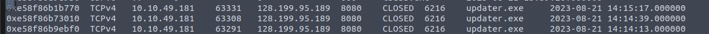
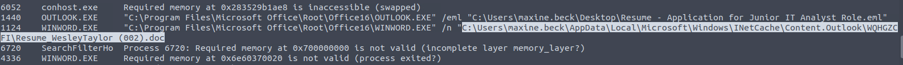

<div align="center">

# 🕵️ Boogeyman 2


</div>

## 📖 Room Overview

The Boogeyman is back, and this time the entry point is the HR inbox. Maxine Beck, a Human Resource Specialist at Quick Logistics LLC, receives what looks like a routine job application: a friendly cover letter and a resume attached as a Word document. The resume is the trap. The moment Maxine opens it, a macro fires and quietly kicks off a chain that ends with an attacker holding a foothold on her workstation.

My job in this room was to reconstruct that whole chain from the artifacts left behind. I had three things to work with: the original phishing email saved as an `.eml`, the malicious `.doc` itself, and a full memory dump of the workstation named `WKSTN-2961.raw`. Working through it meant reading email headers, pulling the macro apart with `olevba`, hashing the attachment, and then spending most of my time in Volatility 3 walking the process tree, tracing the second-stage script to the binary it dropped, finding the command-and-control connection, and finally digging out the persistence mechanism the attacker left behind.

The result is a clean top-to-bottom picture of the intrusion: phishing email, weaponized macro, staged download, C2 callback, and a scheduled task for persistence. This writeup walks that path in the order the investigation naturally unfolded.

# 🎣 Task 1: Introduction

This task just sets the scene and deploys the machine with the artifacts. There are no questions to answer here, so once the box was up and I had the `.eml`, the `.doc`, and `WKSTN-2961.raw` in front of me, I moved straight into the analysis.

# 🔍 Task 2: Spear Phishing Human Resources

This is where the entire investigation lives. Everything from the first email header to the final persistence command comes out of this task, so I worked it in stages: read the email, dissect the macro, then rebuild the rest from memory.

## Concept

The attack is a textbook staged phishing chain. A spear phishing email delivers a macro-enabled document. The macro is a downloader: it reaches out over HTTP, saves a second-stage script locally, and executes it through Windows Script Host. That script pulls down and runs a binary, which becomes the actual implant that phones home to the attacker's C2 server. To survive reboots, the attacker registers a scheduled task that relaunches a hidden PowerShell payload. My analysis follows that same sequence, and each artifact I touch answers one more piece of it.

## Reading the phishing email

Opening the `.eml` gives me the sender, the recipient, and the attachment in one view. Display names are easy to fake, so I go straight to the raw header addresses and the attachment block at the bottom.


**What email was used to send the phishing email?**

westaylor23@outlook.com

> The friendly name on the message reads "Wesley Taylor," but the real address in the `From:` header is an outlook.com account. That mismatch between a corporate-sounding persona and a free webmail sender is the first tell that this is not a genuine applicant.

**What is the email of the victim employee?**

maxine.beck@quicklogisticsorg.onmicrosoft.com

> The `To:` header points at Maxine, the HR specialist. She is exactly the kind of target who opens resumes all day, which is why the attacker aimed a fake job application at her.

**What is the name of the attached malicious document?**

Resume_WesleyTaylor.doc

> The attachment block at the foot of the email shows a single Word document. The `.doc` extension, rather than the modern `.docx`, is a small but telling detail since the legacy format is what supports the VBA macros the attacker needs.

## Fingerprinting the attachment

Before touching the contents, I hash the file so I have a clean indicator to check against threat intel.

```bash
# Fingerprint the malicious attachment
md5sum Resume_WesleyTaylor.doc
```

**What is the MD5 hash of the malicious attachment?**

52c4384a0b9e248b95804352ebec6c5b

> Running `md5sum Resume_WesleyTaylor.doc` produces this hash. It is the identifier I would drop into VirusTotal or an internal IOC list to see whether this exact sample has been seen elsewhere.

## Dissecting the macro with olevba

`olevba` extracts and prints the VBA source straight from the document, so I can read precisely what the macro does without ever opening it in Word. This one carries an `AutoOpen()` routine, meaning it runs automatically the instant the document is opened.

```bash
# Dump and read the VBA macro without detonating the document
olevba Resume_WesleyTaylor.doc
```



The macro reads cleanly. It sets a save path of `C:\ProgramData\`, opens an `XMLHTTP` GET request to a `.png` URL, writes the response body to `update.js`, and then shells out through `wscript.exe` to execute that script. Three answers drop out of those few lines.

**What URL is used to download the stage 2 payload based on the document's macro?**

https://files.boogeymanisback.lol/aa2a9c53cbb80416d3b47d85538d9971/update.png

> This is the address in the macro's `xHttp.Open "GET", "..."` line. It is dressed up as an image with a `.png` extension, but the macro immediately saves the downloaded content as a script instead, which is a common way to slip a payload past casual inspection.

**What is the name of the process that executed the newly downloaded stage 2 payload?**

wscript.exe

> The last meaningful line of the macro is `shell_object.Exec("wscript.exe C:\ProgramData\update.js")`. Windows Script Host, `wscript.exe`, is what actually runs the dropped JScript file.

**What is the full file path of the malicious stage 2 payload?**

C:\ProgramData\update.js

> The macro builds this path from `spath = "C:\ProgramData\"` and the `savetofile spath & "\update.js"` call. `C:\ProgramData` is a writable, low-suspicion location that every user can reach, which makes it a convenient drop point.

**What URL is used to download the malicious binary executed by the stage 2 payload?**

https://files.boogeymanisback.lol/aa2a9c53cbb80416d3b47d85538d9971/update.png

> The same host and path from the macro feed the next stage as well, and the answer format (a six-character name with a three-character extension) confirms it points back at `update.png`. The single download in this chain supplies both the script and the binary it ultimately drops.

## Rebuilding the process tree in memory

With the delivery mechanism understood, I switch to the memory image. `windows.pstree` renders parent and child processes with indentation showing lineage, so I can literally watch Outlook hand off to Word, Word spawn the script host, and the script host launch the implant.

```bash
# Rebuild the process ancestry from the memory image
vol -f WKSTN-2961.raw windows.pstree
```



The chain is unmistakable: OUTLOOK.EXE (1440) spawns WINWORD.EXE (1124), which spawns wscript.exe (4260), which spawns updater.exe (6216). That single line of descent answers the next two questions.

**What is the PID of the process that executed the stage 2 payload?**

4260

> `wscript.exe` sits at PID 4260 in the tree. This is the process that ran `update.js`, matching exactly what the macro told me it would do.

**What is the parent PID of the process that executed the stage 2 payload?**

1124

> The parent of `wscript.exe` is `WINWORD.EXE` at PID 1124. In plain terms, the macro inside the open document is what launched the script host, so Word is the parent process.

## Tracing the binary and the C2 callback

The child of `wscript.exe` is `updater.exe`, and that is the real implant. I pull its launch path out of the process command output and then look for the socket it opened.

```bash
# Recover the launch paths of the script and the dropped binary
vol -f WKSTN-2961.raw windows.cmd | grep "update"

# Find the outbound C2 socket held by the implant
vol -f WKSTN-2961.raw windows.netscan | grep "updater"
```





**What is the PID of the malicious process used to establish the C2 connection?**

6216

> `updater.exe` runs at PID 6216. It is the child of `wscript.exe` in the tree and the process that holds the outbound connection I find next, so it is the binary doing the actual command-and-control talking.

**What is the full file path of the malicious process used to establish the C2 connection?**

C:\Windows\Tasks\updater.exe

> Filtering `windows.cmd` for "update" shows PID 6216 launched from `C:\Windows\Tasks\updater.exe`. Dropping a binary into `C:\Windows\Tasks` is a nice bit of misdirection, since that folder looks system-owned and blends in with legitimate scheduled-task activity.

**What is the IP address and port of the C2 connection initiated by the malicious binary?**

128.199.95.189:8080

> `windows.netscan` filtered for "updater" shows repeated TCPv4 connections from `updater.exe` (PID 6216) out to 128.199.95.189 on port 8080. Port 8080 is a common HTTP-alternate port that tends to attract less scrutiny than something more obviously unusual.



## Locating the cached attachment

When Maxine opened the attachment from Outlook, Windows wrote a working copy into Outlook's secure cache. `windows.cmdline` exposes Word's full launch arguments, and that argument is the exact cached path.

```bash
# Recover the full command lines, including the cached attachment path
vol -f WKSTN-2961.raw windows.cmdline
```



**What is the full file path of the malicious email attachment based on the memory dump?**

C:\Users\maxine.beck\AppData\Local\Microsoft\Windows\INetCache\Content.Outlook\WQHGZCFI\Resume_WesleyTaylor (002).doc

> The `WINWORD.EXE` command line for PID 1124 passes this cached copy as its argument. Outlook stores opened attachments under `INetCache\Content.Outlook\` in a randomly named subfolder, and the `(002)` suffix is just Outlook de-duplicating a filename it had seen before.

## Recovering the persistence command

The `windows.cmdline` plugin did not surface the persistence call, so, following the room's hint, I fell back to carving raw strings out of the dump and grepping for `schtasks`. That immediately brought the full command into view.

```bash
# Fall back to raw strings when the cmdline plugin misses the persistence call
strings WKSTN-2961.raw | grep "schtasks"
```

**The attacker implanted a scheduled task right after establishing the c2 callback. What is the full command used by the attacker to maintain persistent access?**

schtasks /Create /F /SC DAILY /ST 09:00 /TN Updater /TR 'C:\Windows\System32\WindowsPowerShell\v1.0\powershell.exe -NonI -W hidden -c \"IEX ([Text.Encoding]::UNICODE.GetString([Convert]::FromBase64String((gp HKCU:\Software\Microsoft\Windows\CurrentVersion debug).debug)))\"'

> Running `strings WKSTN-2961.raw | grep "schtasks"` pulled this out when the structured plugin came up empty. The task, named "Updater," fires every day at 09:00 and launches a hidden, non-interactive PowerShell process. That PowerShell reads a Base64 blob out of the registry value `HKCU:\Software\Microsoft\Windows\CurrentVersion\debug`, decodes it, and executes it in memory with `IEX`. Stashing the payload in the registry and running it straight from memory means nothing malicious sits on disk for a scanner to catch, which is exactly why this fileless style of persistence is so effective.

## 🧰 Tools Used

| Tool | Purpose | Where I used it |
|------|---------|-----------------|
| Email client / .eml viewer | Read sender, recipient, and attachment headers | Identifying the phishing email and victim |
| md5sum | Generate a file hash for IOC lookups | Fingerprinting the malicious attachment |
| olevba | Extract and read VBA macros from Office documents | Dissecting the AutoOpen downloader macro |
| Volatility 3 (windows.pstree) | Reconstruct process parent/child relationships | Mapping Word to wscript to updater |
| Volatility 3 (windows.cmd / windows.cmdline) | Recover process launch paths and arguments | Finding the binary and cached attachment paths |
| Volatility 3 (windows.netscan) | List network sockets from memory | Locating the C2 IP and port |
| strings + grep | Carve plaintext artifacts from the raw dump | Recovering the persistence command |

## 👨‍💻 Author

**Sanjish K C**

CompTIA Security+ | MS Cybersecurity Candidate at Webster Un